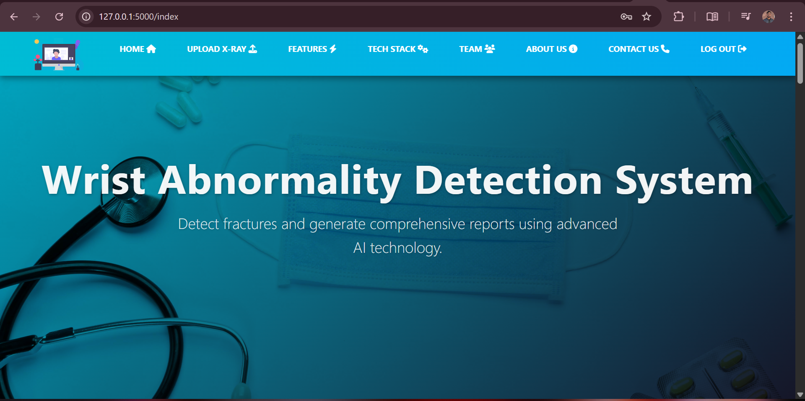

# Final Year Project – YOLOv9 & LLM Integrated Diagnostic System

This is my Final Year Project that integrates the official YOLOv9 repository [YOLOv9](https://github.com/WongKinYiu/yolov9) with a custom-trained Fracture detection model for X-ray image diagnosis. The YOLOv9 model was trained from scratch on a medical imaging dataset [GRAZPEDWRI-DX] to accurately detect specific anomalies. The project also includes a Flask-based web interface for image uploads, real-time predictions, and diagnostic report generation using Large Language Model (LLM).

## 📁 Project Structure

- `app/` – Flask application files
- `models/yolov9/` – YOLOv9 official repo (as a Git submodule)
- `static/` – CSS, JS, and image files
- `templates/` – HTML templates for the app

## 🖼️ System Screenshots

### Login Page


### Home/Landing Page


### Detection Results


### Detailed Results View


### Diagnostic Report


## 🚀 How to Clone

```bash
git clone https://github.com/IslamNabi/Wrist-Abnormality-Detection-System-Using-Yolov9-and-LLMs.git
cd Wrist-Abnormality-Detection-System-Using-Yolov9-and-LLMs
git submodule update --init --recursive
